# Jarkom-Modul-4-IT10-2024


# Anggota Kelompok
| Nama | NRP |
| ---------------------- | ---------- |
| Khansa Adia Rahma      | 5027221071 |
| Gilang Raya Kurnaiwan   | 5027221045 |

Soal Jarkom Modul 4 2024

- Soal shift dikerjakan pada Cisco Packet Tracer dan GNS3 menggunakan metode perhitungan CLASSLESS yang berbeda.

- Keterangan: Bila di CPT menggunakan VLSM, maka di GNS3 menggunakan CIDR atau sebaliknya
  
- Jika tidak ada pemberitahuan revisi soal dari asisten, berarti semua soal BERSIFAT BENAR dan DAPAT DIKERJAKAN.
  
- Untuk di GNS3 CLOUD merupakan NAT1 jangan sampai salah agar bisa terkoneksi internet.
  
- Pembagian IP menggunakan Prefix IP yang telah ditentukan pada modul pengenalan
  
- Pembagian IP dan routing harus SE-EFISIEN MUNGKIN.
 
- Seluruh node yang ada pada topologi harus dapat TERKONEKSI satu sama lain dan dapat melakukan PING ke node lainnya yang ada di topologi


# Prefix IP
Prefux IP yang diguanakan kelompok kami ```192.238```

# VLSM
VLSM merupakan metode yang dilakukan untuk pengoptimalan pemetaan IP address terhadap user, dimana VLSM adalah pengembangan mekanisme subneting sehingga di dalam VLSM dilakukan peningatan dari kelemahan subneting klasik, yang mana dalam subneting klasik, subnet zeroes serta subnet ones tidak bisa digunakan.

# CIDR

CIDR adalah singkatan dari "Classless Inter-Domain Routing" yang merupakan sebuah metode untuk mengalokasikan dan mengelola alamat IP dalam jaringan komputer. Metode ini memungkinkan untuk pengelompokan alamat IP secara lebih efisien daripada metode yang lain yang menggunakan kelas seperti Class A, B, dan C. Dengan CIDR, alamat IP dipecah menjadi blok-blok yang lebih kecil yang disebut sebagai "CIDR blocks". Setiap blok CIDR terdiri dari alamat IP bersama dengan angka yang menunjukkan jumlah bit dari alamat IP yang digunakan untuk menyatakan jaringan, biasanya ditunjukkan dalam notasi seperti "alamat IP/prefix_length". Misalnya, "192.238.1.0/24" menunjukkan bahwa 24 bit pertama dari alamat IP tersebut digunakan untuk menunjukkan jaringan, sementara sisanya digunakan untuk mengidentifikasi host dalam jaringan tersebut. Ini memungkinkan fleksibilitas yang lebih besar dalam penentuan ukuran jaringan dan alokasi alamat IP.

# Rute berdasarkan Topologi
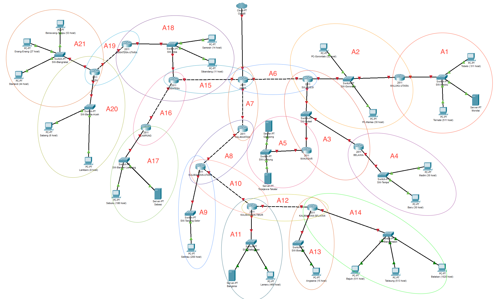
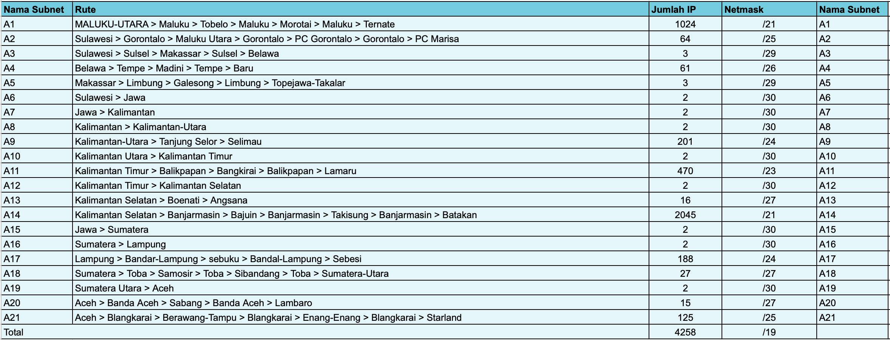

# SUBNET
sebagai tabel acuan
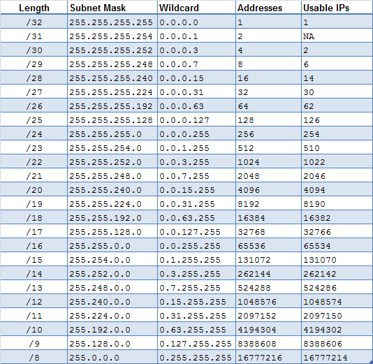

Berdasarkan rute tersebut, diperoleh hasil berikut:
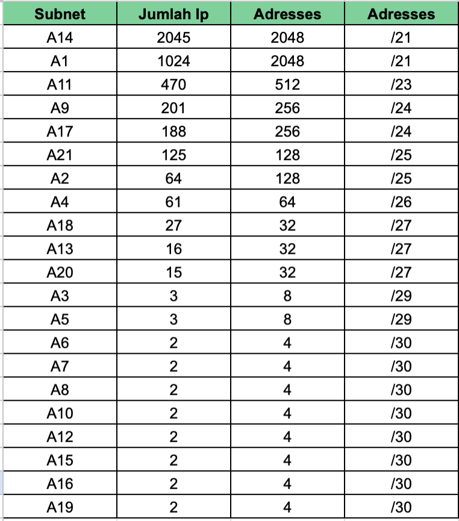

Dengan total length yang diperoleh ialah /19 dan length berapa saja dengan jumlah berapa yg dibutuhkan, maka dapat kita gunakan untuk membuat tree dan mendapatkan NID. Berikut adalah tree VLSM

# Tree VLSM
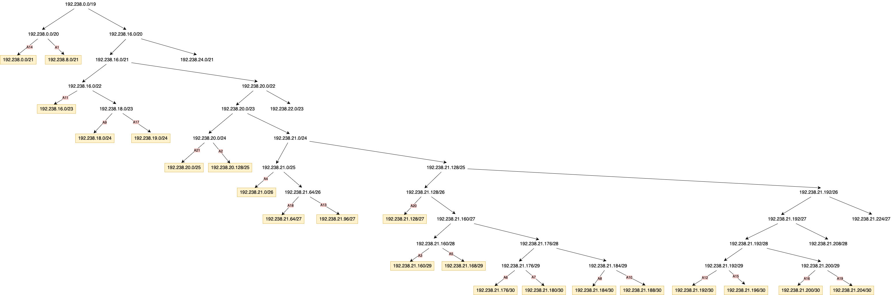

berdasarkan tree tersebut maka diperoleh Network ID, dan berdasarkan tabel acuan subnet di atas kita dapat mengetahui netmask sesuai dengan length, serta bisa dihitung IP Broadcast dan Range IPnya, sebagai berikut:

# Pembagian IP VLSM
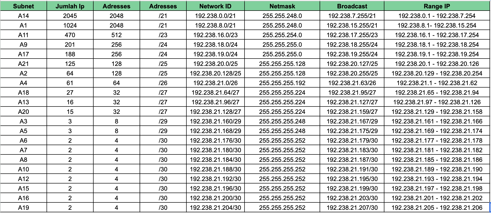

Setelah itu, kita dapat membuat topologinya menggunakan Cisco Packet Tracer .

# Topologi CPT VLSM
Untuk membuat topologi, pada CPT dan menambahkan Router, Switch, dan PC dapat dilakukan dengan drag and drop yang ada pada menu. Pada praktik kali ini, sesuaikan device dengan pilihan dengan kotak merah pada gambar di bawah
- menambahkan cloud
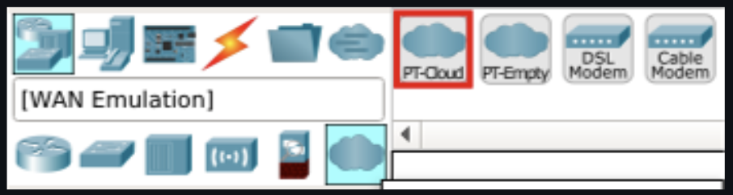
- menambahkan router
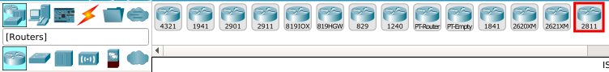
- menambahkan switch
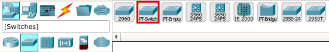
- menambahkan PC
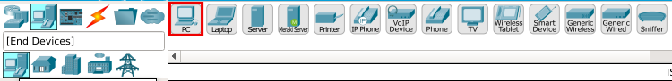
- menambahkan cable
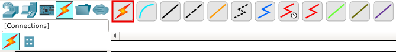

apabila saat menyambungkan antar node maupun router terdapat popup notification seperti ini:
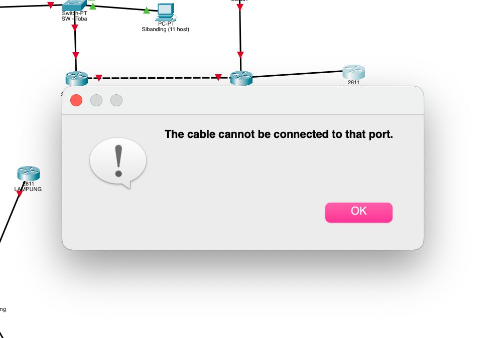

maka lakukan langkah berikut:
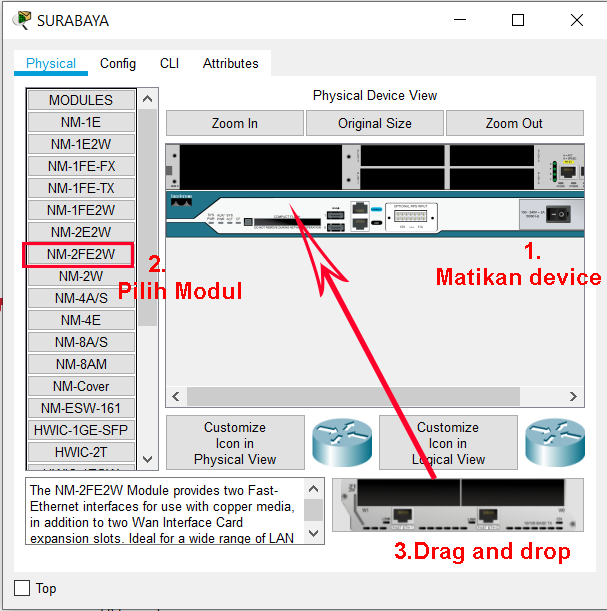

Topologi yang sudah jadi akan seperti berikut ini:
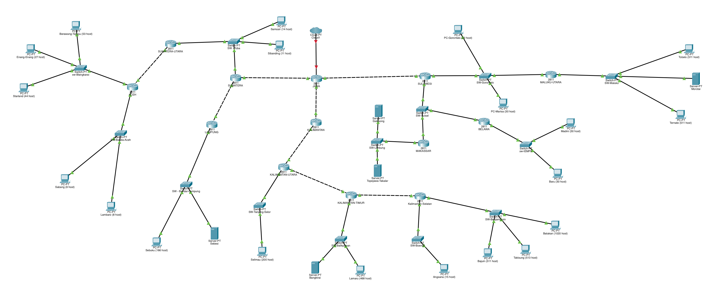

# Config VLSM CPT

Selanjutnya, kita dapat melakukan config pada masih masing router.

1. Contoh config untuk JAWA > SULAWESI yaitu rute A6
klik 2 kali pada router *jawa*, klik pada bagian tab cli. ketik ``en`` untuk masuk ke mode privilege mode, lalu dilanjutkan dengan ``conf t`` untuk masuk ke mode global configuration.

selanjutnya untuk config Jawa ke Sulawesi pada tab *config* 
masukan IPv4 Address beserta subnet mask sesuai dengan eth yg terhubung. 
IPv4 Address di sini menggunakan ``192.238.21.177`` didapat dari rute JAWA>SULAWESI yang termasuk ke A6. dan IP tersebut adalah NID dari A6 ditambahkan dengan 1.
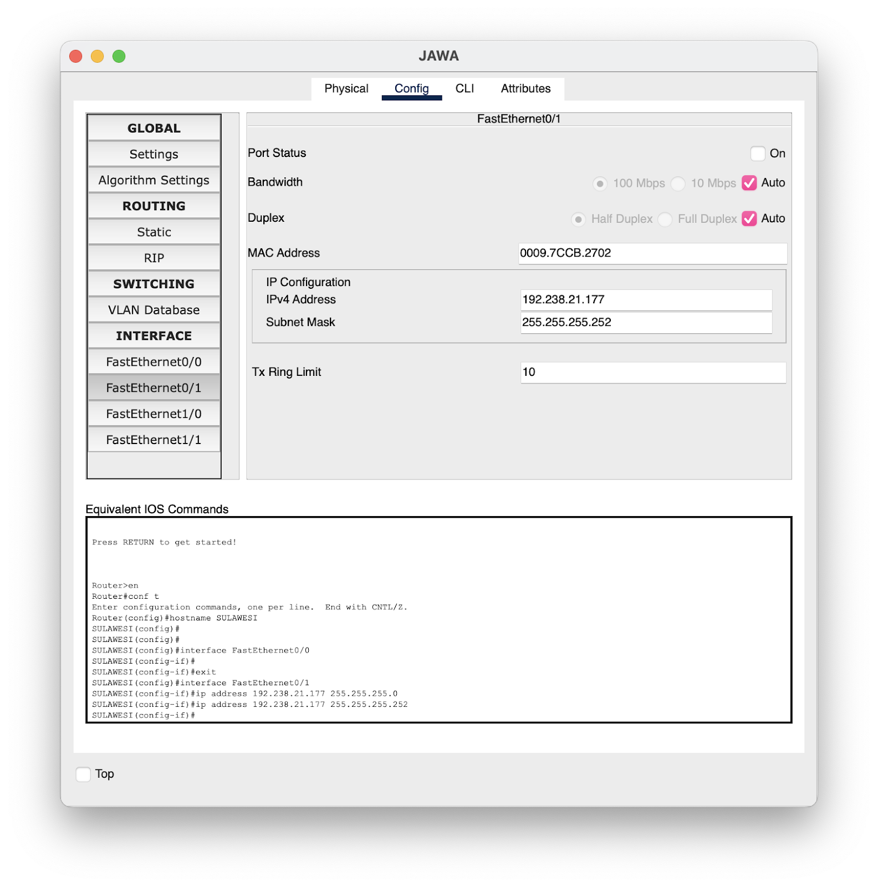

selanjutnya, pada cli katikkan ``no sh`` dan ``do sh ip int brief``
sehingga akan start dan seperti ini:
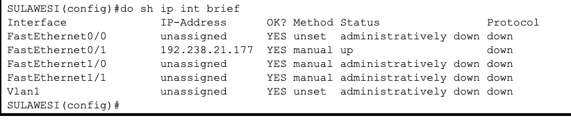

2. contoh config untuk SULAWESI > JAWA
Pada cli di router Sulawesi, ketik ``en`` lalu ``conf t`` lalu ketikkan ``hostname JAWA``
Selanjutnya pada tab config ketikkan IPv4 Address untuk menghubungkan ke jawa menggunakan ip broadcast dari A6 dan dikurangin 1 sehingga menjadi ``192.238.21.178``

jika sudah, jangan lupa pada cli untuk menstart dengan ``no sh`` dan lihat menggunakan ``do sh ip int brief``


Lakukan hal yang sama pada semua router

# atur IP Client
untuk mengatur ip pada client dapat dengan
1. Masuk ke client
2. Pilih tab Desktop
3. Pilih IP Configuration

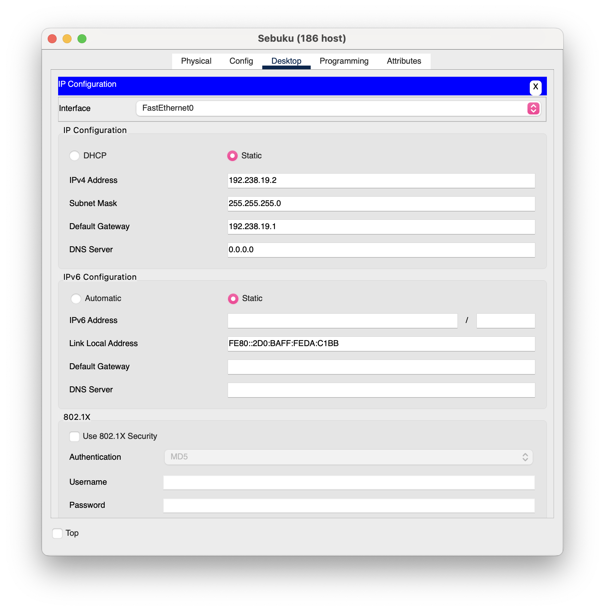

untuk IPv4 Adress bisa diisi menggunakan salah satu IP dari range IP yang sesuai dengan subnet client, misal contoh gambar di atas menggunakan client pada A17, berarti kedua clientnya menggunakan salah satu IP dari rentang (192.238.19.1 - 192.238.19.254), dengan catatan harus berbeda dari default gateway.

# Routing
- Routing dilakukan pada router, dengan masuk ke bagian Config > Routing > Static
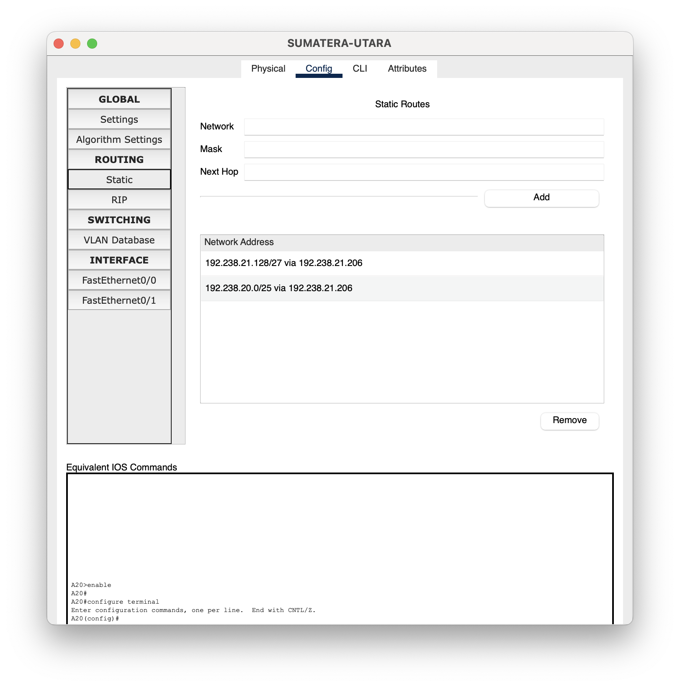
diisi dengan network adalah NID dari subnet client atau yg mau dihubungi, lalu next hop diisi dengan IP Broadcast pada subnet yg akan dilewati dikurang 1 untuk menyambungkan subnet. 

- dan untuk menyambungkan antar router (biasanya dari router terdekat client ke router tempat subnet client di routing), maka network dan mask diisi dengan `0.0.0.0` dan next hop diisi dengan NID+1.

contoh untuk menyambungkan Lampung > Sumatera
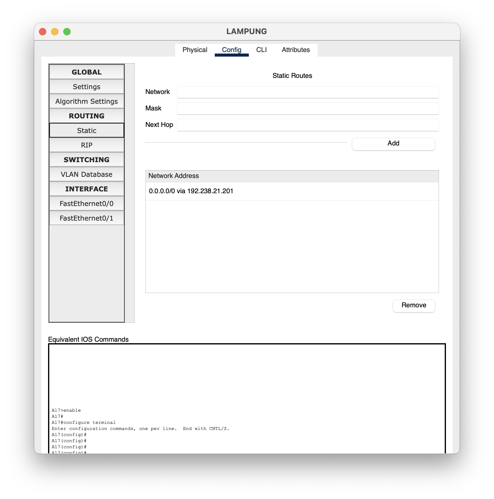

- Selanjutnya pada router JAWA, dilakukan routing untuk semua subnet dengan next hop diisi dengan subnet yg terdekat dan terhubung langsung oleh jawa, pada topologi tersebut terlihat terdapat A6, A17, A15.
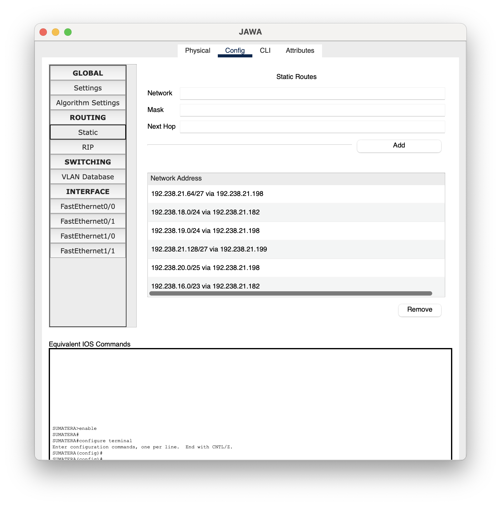

# Ping
Untuk mengetesnya dapat dilakukan dengan cara ping dari client ke IP tujuan atau menggunakan tombol dengan ikon surat pada toolbar.
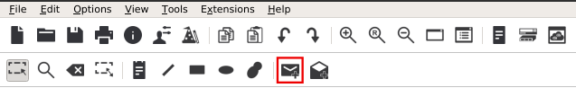


# Tolopogi GNS CIDR

Berikut adalah Topologi Pohon CIDR


# Penggabungan Subnnet CIDR

Berikut adalah Penggabungan Subnnet


# Pembagian IP dari subnet CIDR

Berikut adalah Grouping, Pembagian IP dari subnet CIDR dan Tree nya

Grouping


Tree

Setelah di lakukan grouping data data yang ada dioalah dengna menggunakan teknik tree, dengan menyusun dari class paling tinggi ke paling rendah, dengan class yang paling rendah yang nantinya akan diambil misal subnet A1,A2, etc.


Lalu dilakukan Pembagian IP sesuai dengan hasil yang di dapat pada proses tree


# Konfigurasi IP CIDR

Node Jawa

```
auto eth0
iface eth0 inet dhcp

auto eth1
iface eth1 inet static
    address 192.238.148.1
    netmask 255.255.255.0

auto eth2
iface eth2 inet static
    address 192.240.0.1
    netmask 255.255.255.0

auto eth3
iface eth3 inet static
    address 192.238.68.1
    netmask 255.255.255.0
```

Node Sumatra

```
auto eth0
iface eth0 inet static
    address 192.238.136.2
    netmask 255.255.255.0
    gateway 192.238.136.1
```


